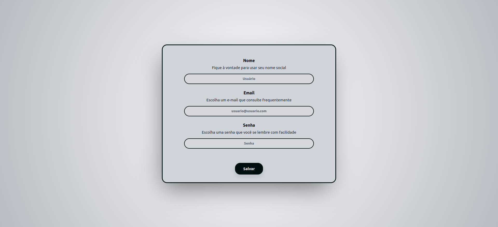
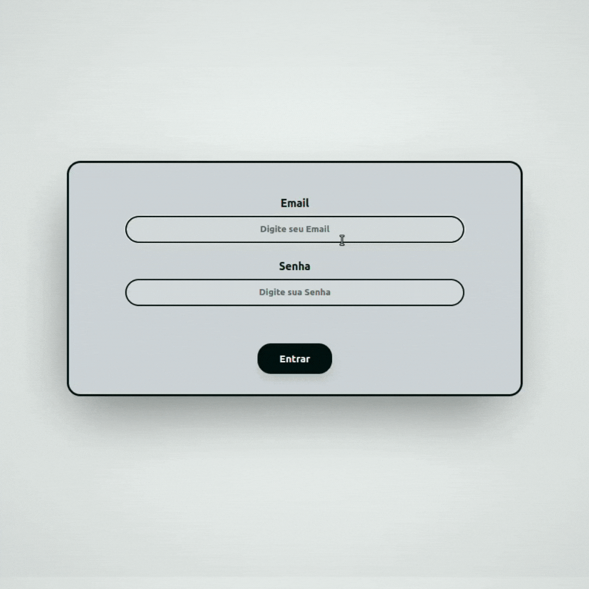
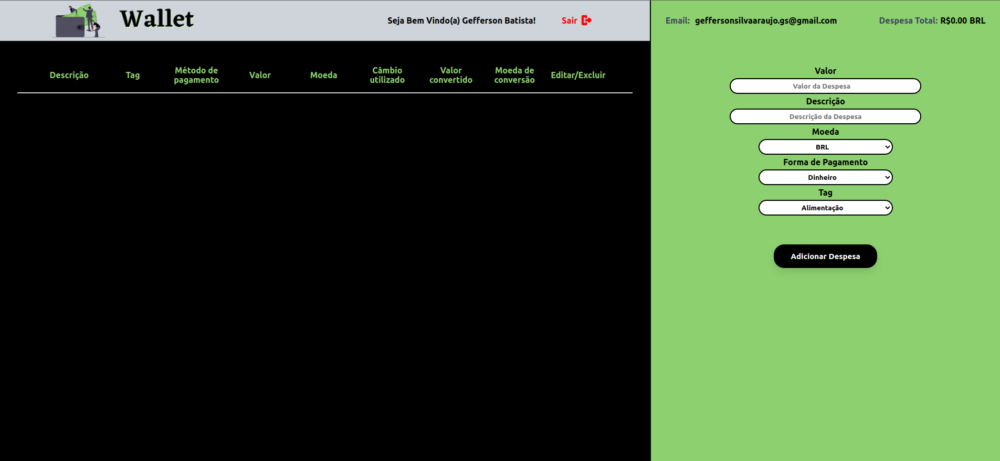
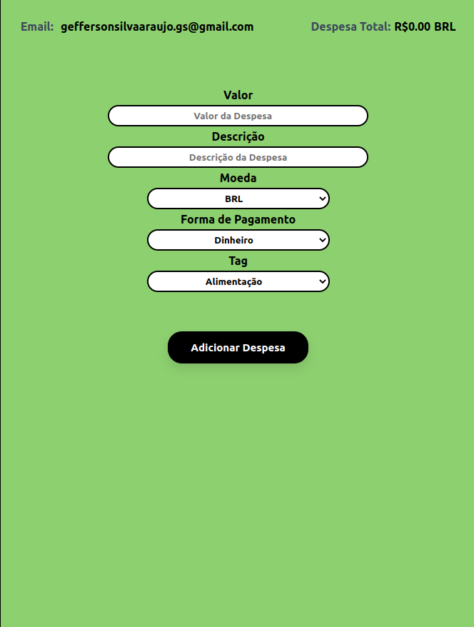
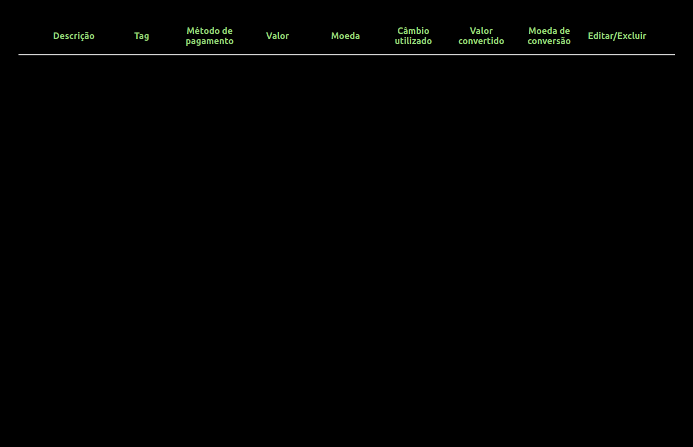

# TrybeWallet
[](https://github.com/tterb/atomic-design-ui/blob/master/LICENSEs)


Esta é uma carteira online para controle de gastos com conversão de moedas.

Ao utilizar essa aplicação um usuário poderá:

- Adicionar, remover e editar um gasto;
- Visualizar uma tabela com seus gastos;
- Visualizar o total de gastos convertidos para uma moeda de escolha;


## Documentação da API de Cotações de Moedas

A aplicação consome os dados da API do awesomeapi API de Cotações para realizar a busca de câmbio de moedas. 

**O endpoint utilizado foi:**

 - https://economia.awesomeapi.com.br/json/all

**O retorno é algo semelhante á isso:**

```
{
  user: {
    email: '',
  },
  wallet: {
    currencies: [],
    expenses: []
  }
}
```

Se você quiser aprender mais informações sobre a API, veja a [documentação](https://docs.awesomeapi.com.br/api-de-moedas).

---

## Demonstração


### Página de Home

A página inicial da aplicação, que oferece dois caminhos ao usuário, fazer login caso já possua conta, ou criar conta para entrar na carteira.

  

### Página de Registro

Essa página possui campos para registro de email, senha e nome do usuário no localStorage, onde serão utilizados esses dados para fazer login e entrar na carteira.

  
### Página de Login

A página possibilita a pessoa usuária fazer login, com email e senha que foram salvos no localStorage através da página /register.

  

### Página da Carteira

Na página /wallet é onde se pode gerenciar a carteira de gastos em diversas moedas, trazendo a despesa total com base na moeda real que é representado pelo código 'BRL'.

  
### Formulário de adição de Despesa

No formulário de adição de Despesa, há 5 campos em que a pessoa usuária pode indicar um valor, descrição, moeda, forma de pagamento, tag e um botão para adicionar a despesa.

  
### Tabela de Gastos

  * A tabela possui 9 colunas com as seguintes opções. Descrição, Tag, Método de pagamento, Valor, Moeda, Câmbio utilizado, Valor convertido e Moeda de conversão e Editar/Excluir.

  
#### Botão Excluir

  

  * O botão é o último item da linha da tabela representado por uma lixeira da cor vermelha`.

  * Ao ser clicado, o botão deleta a linha da tabela e recalcula o valor da despesa total.

#### Botão Editar

  

  * O botão fica ao lado do botão de excluir e é representado pelo ícone azul`

  * Ao ser clicado, o botão habilita um formulário para editar a linha da tabela. Ao clicar em "Editar despesa" a linha da tabela é atualizada com as novas informações preenchidas no formulário.


## Deploy

- **Vercel:** https://trybewallet-imgeff.vercel.app/

## Para instalar localmente

1. Clone o repositório
  * `git clone git@github.com:imgeff/trybewallet.git`
  * Entre na pasta do repositório que você acabou de clonar:
    * `cd trybewallet`

2. Instale as dependências e inicialize o projeto
  * Instale as dependências:
    * `npm install`
  * Inicialize o projeto:
    * `npm start` (uma nova página deve abrir no seu navegador com um texto simples)

3. Crie uma branch a partir da branch `master`

  * Verifique que você está na branch `master`
    * Exemplo: `git branch`
  * Se não estiver, mude para a branch `master`
    * Exemplo: `git checkout master`
  * Agora, crie uma branch onde você vai guardar os commits do seu projeto
---

## Linter

Para garantir a qualidade do código, neste projeto foi utilizado o linter ESLint. Assim o código foi alinhado com as boas práticas de desenvolvimento, sendo mais legível e de fácil manutenção! Para rodar o *linter* localmente no projeto, execute o comando abaixo: 

`npm run lint`

---

    
## Aprendizados

Para este projeto o maior desafio foi entender o fluxo de trabalho do Redux, acabei assistindo as aulas do course da Trybe mais de uma vez e praticando muito através dos exercícios pra pegar o jeito. O projeto então foi feito com o objetivo de consolidar as seguintes habilidades:   

  * Criar um store Redux em aplicações React

  * Criar reducers no Redux em aplicações React

  * Criar actions no Redux em aplicações React

  * Criar dispatchers no Redux em aplicações React

  * Conectar Redux aos componentes React

  * Criar actions assíncronas na sua aplicação React que faz uso de Redux.

## Melhorias

- Criação da página Home
- Criação da página de Registro
- Criação de logo
- Feedback de preenchimento no formulário de login
- Validação de login utilizando localStorage
- Mensagem de boas vindas
- Adição do Real brasileiro na lista de moedas
- Novo Favicon
- Botão de logout


## Stack utilizada

**Front-end:** HTML, CSS, JavaScript, React, Redux

## Feedback

Se você tiver algum feedback, por favor mande uma mensagem em  https://www.linkedin.com/in/imgeff/

